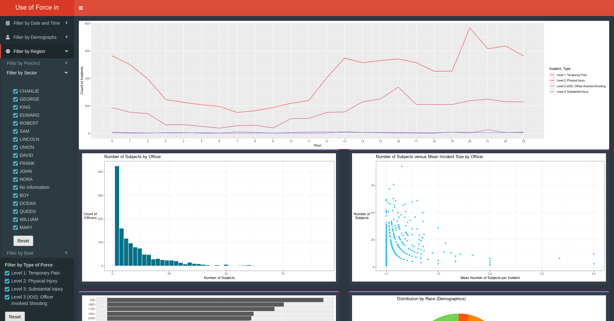

# Redesign of Seattle Police Department's Use of Force Dashboard

## Table of Contents

- [About](#about)
- [Getting Started](#getstarted)
  - [Installing Dependencies](#installing)
  - [Running](#running)

## About <a name="about"></a>

This project redesigns the [SPD UoF dashboard](https://www.seattle.gov/police/information-and-data/use-of-force-data/use-of-force-dashboard) in order to better understand certain aspects of the data.



Data for this dashboard is pulled from the [UoF dataset](https://data.seattle.gov/Public-Safety/Use-Of-Force/ppi5-g2bj) provided by the SPD.

## Getting Started <a name="getstarted"></a>

### Installing Dependencies <a name="installing"></a>

The [R programming language](https://www.r-project.org/) is required to run this application. Use the appropriate method of installing for your Distribution/OS.

For Ubuntu this would be:

```bash
sudo apt install r-base
```

Next, in an R console, install the necessary packages using the following command:

```R
install.packages("tidyverse", "lubridate", "shiny", "shinydashboard", "dashboardthemes")
```

This step can take a while. Before downloading R may also ask you to choose a mirror.

### Running <a name="running"></a>

To run the application using the command line, simply use the following command in the same directory as the app file:

```bash
Rscript app.R
```

`app.R` can also be run by opening it in RStudio and clicking the run button.

Once the application is running the line `Listening on http://127.0.0.1:####` should appear in the console. Click or copy/paste the link into a browser to see the dashboard.
